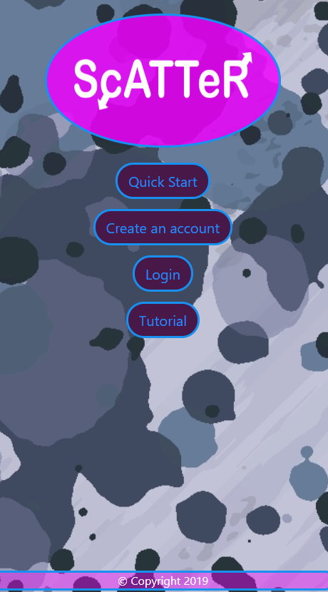

# **ScATTeR - Real time group locator, when you want it**

## Table of contents
* [General info](#general-info)
* [Using the app](#using-the-app)
* [Technologies](#technologies)

## General info
Nothing is more frustrating when you and your friends make plans to get together for an event and you spend all your energy trying to text everyone back and forth asking “are you there yet?” or “are you on your way?” 
Using ScATTeR you and your friends can locate each other in real time. Concerned about location privacy? With our web app you can choose when your location is being used. 
	
## Using the app
To use the app, head over to https://scatter-web.herokuapp.com/ and then you can either create an account and login or you can use the quick start. 
 

 
The quick start lets you create a group event and invite friends without having to create an account and log in. The advantage to creating an account is you can access past groups you’ve made without losing them.
Once you’re in you can send your friends an invite link via sms text or email. They can then access the group event with their individual unique link (similar to the quick start) 
Now you and your friends can access the group event page, from there you can check your friends’ location on the map, as well as they can check on you. When someone arrives, they can hit the arrived button and the app will stop tracking their location.
A different feature behind the app is, if one of the group wants to split off for a time but not leave the group event, all they have to do is hit the ScATTeR button.

## Technologies
Below is a list of the different technologies used in creating the web app ScATTeR,
Axios: 0.19.0, bcrypt: 3.0.6, cors: 2.8.5, dotenv: 8.2.0, express: 4.17.1, express-session: 1.17.0, googleapis: 44.0.0, mysql2: 2.0.0, nodemailer: 6.3.1, ol (OpenLayers): 6.1.0, react: 16.11.0, react-router-dom: 5.1.2, reactstrap: 8.1.1, sequelize: 5.21.1, sequelize-cli: 5.5.1, twilio: 3.35.1
Along with all those we’re working with Geolocation API and Material Icons. 

	
